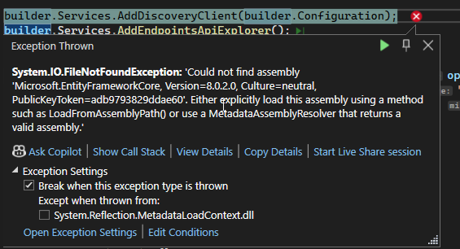

# Dokumentation

## KW 50

Diese Woche habe ich mit der Umsetzung begonnen. Als Erstes habe ich eine Solution mit dem Frontend-Service erstellt. Da ich .NET 8 verwende, habe ich nicht das Blazor Server Template (.NET 7) verwendet, sondern das Blazor Web App Template (.NET 8). Danach habe ich MudBlazor für das Frontend aufgesetzt. MudBlazor ist eine UI-Komponenten-Library, die das Erstellen von Benutzeroberflächen erleichtert. Im Frontend habe ich alle benötigten Pages erstellt (die meisten ohne Inhalt). Zudem habe ich mit dem Produktkatalog-Service angefangen. Ich konnte jedoch bisher nur das Projekt erstellen.

## KW 51
Diese Woche konnte ich die Endpunkte für den Produktkatalog-Service umsetzten. Momentan ist der Service noch nicht mit einer Datenbank verbunden, es existieren nur Beispiel Daten im Projekt selbst. Danach wollte ich das API-Gateway erstellen, jedoch ist mir aufgefallen, dass es mehr Sinn machen würde, die Service Discovery zuerst zu erstellen, da das Gateway die anderen Services über die Registry der Service Discovery finde. Weshalb ich nur das Projekt für die das Gateway erstellt habe. Zu Service Discovery Eureka mit .NET habe ich nur ein Tutorial gefunden, dieses zeigt jedoch nur ein Beispiel mit .NET Core und nicht mit ASP.NET Core, weshalb mir dieses nicht weiterhilft.

## KW 2
Diese Woche habe ich weiter nach Beispielen gesucht, wie man die Registrierung bei einer Eureka Service Registry in einem ASP.NET Core Projekt umsetzten kann. Ich habe eine [Anleitung](https://docs.steeltoe.io/guides/service-discovery/eureka.html?tabs=cli) von Steeltoe gefunden. Ich habe mein Projekt so angepasst wie in der Anleitung beschrieben, jedoch taucht der Service nicht in der Registry auf. Weshalb ich die Eureka-Service Registry aus einem der Beispiel Projekte aus dem Unterricht in das Projekt kopierte, jedoch hatte ich auch mit dieser kein Erfolg.

## KW 3
Diese Woche habe ich herausgefunden, wie man die Service Registrierung in .NET umsetzen kann.  Ich musste hierzu den steeltoe initializr verwenden, welcher eine C-Sharp Projekt erstellt. Als ich dieses so angepasst habe wie in der Anleitung letzte Woche beschrieben habe wurde der Service registriert. Danach habe ich ein Docker-Compose-File erstellt, in welchem der Eureka-Container erstellt wird. Zudem habe ich ein MySQL-Datenbank-Container für den Produkt-Service im Compose-File definiert. Dieser führt beim Starten ein SQL-File aus, welches die Tabellen mit Beispieldaten für den Produkt-Service erstellt. Als Nächstes habe ich die Datenbankkommunikation umgesetzt. Hierfür habe ich ein sogenannten DbContext verwendet, diese ermöglicht es mit der Datenbank zu kommunizieren ohne SQL schreiben zu müssen.
Als Nächstes habe ich das Projekt kopiert und für den Bestell-Service angepasst. Als ich den Zugriff auf den Produkt-Service umsetzten wollte, bemerkte ich, dass keiner der beiden Services sich bei Eureka registrierte. Weshalb ich in Visual Studio die Common Language Runtime Exceptions aktivierte. Worauf ich den folgenden Fehler bekam:

Woraufhin ich in den Dependecys nachschaute, welche Version ich von diesem Package habe, jedoch stimmte dies mit der Erwarteten überein. Woraufhin ich folgende Schritte unternahm:

-	Den bin und obj Ortner löschen (Enthalten die ausführbare Version der Applikation)
-	Die Befehle dotnet clean und dotnet restore ausgeführt (Deinstallieren und Installieren alle Packages erneut)
-	Computer neustarten
- Package deinstalliert und erneut installiert
- Package geupdatet

Nach all diesen Schritten funktionierte das Registrieren immer noch nicht. Weshalb ich das .csproj anschaute und dieses mit dem des ursprünglich heruntergeladenen Projekts verglich, jedoch half dies auch nicht. Ich habe keine Ahnung wie ich diesen Fehler beheben könnte. Verwunderlich ist jedoch, dass ich das Projekt ausführen kann und die API problemlos funktioniert. Obwohl die Fehlermeldung sagt, das Microsoft.EntityFrameworkCore (Package für Datenbank zugriff) nich gefunden wird. Sommit dürfte die API auch nicht auf die Datenbank zugreifen können.
Da ich in die Fehlerbehebung sehr viel Zeit investiere, habe ich mich dazu entschieden das API-Gateway anhand der Dokumentation umzusetzen, ohne es testen zu können. Hierfür habe ich mir die Dokumentation zu Ocelot angeschaut und wie man mit diesem dynamisch aus der Service Regsistry die Ports der anderen Services herausfinden kann. Zum Schluss habe ich noch den Bestell-Service fertig gestellt. Mehr konnte ich leider zeitlich nicht mehr umsetzten.
